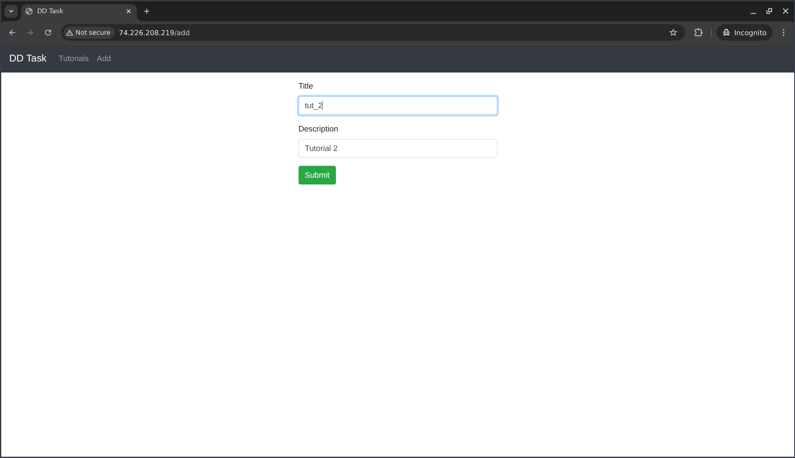

# MEAN CRUD App: Setup, Containerization & Deployment


## Project Overview

A full-stack MEAN (MongoDB, Express, Angular, Node.js) CRUD application, containerized and deployed using Docker Compose, with automated CI/CD via GitHub Actions.

---
### Setup
```bash
git clone https://github.com/Pranav-Saraswat/crud-dd-task-mean-app.git
cd crud-dd-task-mean-app
```

### Build Images

```bash
# Backend
docker build -t pranavs24/mean-backend ./backend

# Frontend
docker build -t pranavs24/mean-frontend ./frontend
```

### Push Images

```bash
docker login
docker push pranavs24/mean-backend
docker push pranavs24/mean-frontend
```

---

## Deployment

1. **Set up Ubuntu VM** 
2. **Install Docker & Docker Compose**
	 ```bash
	 sudo apt update
	 sudo apt install docker.io docker-compose -y
	 ```

3. **Clone Repository on VM**
	 ```bash
	 git clone https://github.com/Pranav-Saraswat/crud-dd-task-mean-app.git
	 cd crud-dd-task-mean-app
	 ```

4. **Edit `frontend/nginx.conf`**
```
events {
    worker_connections 1024;
}
http {
    include mime.types;
    default_type application/octet-stream;

    server {
        listen 80;

        location / {
            root /usr/share/nginx/html;
            index index.html index.htm;
            try_files $uri $uri/ /index.html;
        }
        location /api/ {
            proxy_pass http://backend:8080;
            proxy_set_header Host $host;
            proxy_set_header X-Real-IP $remote_addr;
            proxy_set_header X-Forwarded-For $proxy_add_x_forwarded_for;
            proxy_set_header X-Forwarded-Proto $scheme;
        }
    }
}
```

5. **Edit `docker-compose.yml`**  

```yaml
version: "3.9"

services:
  mongo:
    image: mongo:6
    container_name: mongo
    restart: unless-stopped
    ports:
      - "27017:27017"
    volumes:
      - /app/mongo_data:/data/db

  backend:
    image: docker.io/pranavs24/mean-backend:latest
    container_name: backend
    restart: unless-stopped
    ports:
      - "8080:8080"
    environment:
      - NODE_ENV=production
      - MONGO_URL=mongodb://mongo:27017/dd_db
    depends_on:
      - mongo

  frontend:
    image: docker.io/pranavs24/mean-frontend:latest
    container_name: frontend
    restart: unless-stopped
    ports:
      - "80:80"
    depends_on:
      - backend

volumes:
  mongo_data:
```

5. **Start the Application**
	 ```bash
	 docker-compose up -d
	 ```

---


## Accessing the Application

- Open your VM’s public IP in a browser: `[http://74.226.208.219/](http://74.226.208.219/)/`
- The app is available on port 80.

---

### Screenshots


## ShowCase Screenshots

| Home Page                | Add Tutorial                | Add Success                  |
|--------------------------|-----------------------------|------------------------------|
|  |  |  |
|  **Edit Tutorial**        | **Home After Add**          | **Home After Delete**        |
|  |  |  |

## CI/CD ScreenShots
| **CI/CD Main** | **CI/CD Build Tree** | **CI/CD Deploy Tree** | **CI/CD Config** |
|----------------|---------------------|----------------------|------------------|
|  |  |  |  |

## Docker Image Build And push on CI/CD
|**Docker Image Build And Push Tree**|
|---------|
||
